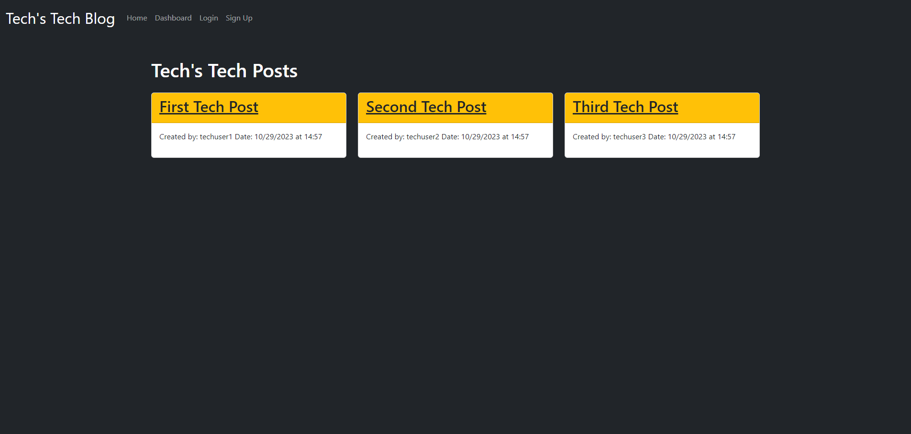

# Tech-Blog

## Description
 This Tech Blog will allow users to publish their blog posts and comment on other developers' posts as well. This app applies the MVC (Model View Controller) design pattern which are built to handle specific development aspects of the application. This app will be utilizing Handlebars, Sequelize, and Express-Session for functionality. 

## Table of Contents
* [Usage](#usage)
* [Contact-Me](#contact)
* [Contributors](#contributors)
* [Testing](#testing)
* [Application](#application)
* [License](#license)

## Usage
Users will be able to sign up with their log-in information and start posting! 
## Mock-Up
The following image shows the command-line application's appearance and functionality:

## Application

Please click on the [link](https://rs-tech-blog-ff26cfc66031.herokuapp.com/) to visit the Tech Blog application. 

## Contact
* Name - Ricardo Scuotto
* Email - ucfscuotto@gmail.com
* Github - [Ricky-Sama](https://github.com/Ricky-Sama/)
## Contributors
N/A
## Testing
N/A
## License

        Licensed under the MIT license